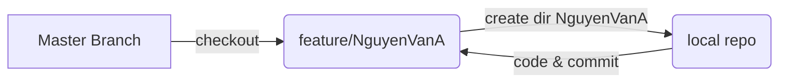

# Ansible-TOAA06
Ansible labs for Course TOAA06

## Description
This is the public repo that uses for students in class TEL4VN-TOAA06. Each student create a feature branch with name feature/Name-Of-Student and create a separate dir for each roles.

**Note:**  **Do not commit on master branch** 

This is example flow chart:



## How to contribute code
Please kindly remember that **DO NOT** commit on master branch. We should following steps below:

1. Clone repo to local machine by using command

```
    git clone https://github.com/vytran4love/Ansible-TOAA06.git
```
2. Checkout branch feature

```
    cd Ansible-TOAA05
    git branch
    git checkout -b "feature/NguyenVanA"
```
3. Add and commit code on branch feature

```
    git add -A
    git commit -m "Message you want to mark note"
```

4. Git push

```
    git push
```    
5. Make a PR to master branch

## Overall Folder Structure
Following is overall folder structrue

```
├── README.md
└── day1
    ├── docs
    │   ├── ansible.cfg
    │   ├── day1.md
    │   └── hosts
    └── labs
        └── day01_inventory.md
```

